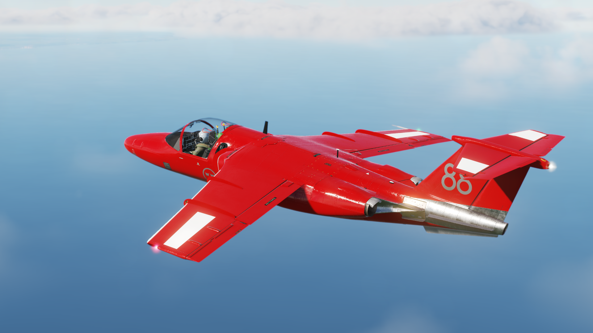

# DCS-SK60-Mod

 
A Saab SK60 mod for Digital Combat Simulator World.
 
Note: The Externel FLight Model Code will be released later. 
 

## Table of Contents
- [Background](#background)
- [Aircraft Info](#(Aircraft))
- [Progress](#Progress)
- [TO-DO List](#TO-DO)
- [Install](#install)
- [Usage](#usage)
- [Contributing](#contributing)
- [License](#license)

## Background
This project is aim to create a SK-60/Saab 105 light training jet module for DCS World Simulation. The project will kept on mod level and use the EFM (externel flight model)
Creating of the 3D model is based on the Blender.

## Aircraft Info
### Instruments
+ Garmin NS430 [navigation]
+ SAAB F35-1, OCH-2 [eadi]
+ Sandel SN3500 [ehsi]
+ R&S®GB6500 Remote control unit [radio] 

## Progress
### Fully Functional
+ Externel Flight Model
+ Basic Instruments
+ Basic Avionics
+ Basic Radio Link to Game
+ Basic Moving Map and Routes
+ Basic Weapon System
+ On Screen Menu
+ EADI
+ E Altimeter
### Partial Functional
+ EHSI
+ Navigation Unit
+ Radio Unit

## TO-DO
### Functions
+ See in link below: https://docs.google.com/spreadsheets/d/1nlrEghej1rFCXLv4O9qpI_PqkWHY3rdk3nWyn6rrHKA/edit#gid=0
+ Radio System working, try implement the R&S GB6500 UHF radio
+ Add more elements and function to Navigation part
+ Change some clickable stuff to the keyboard/joystick input
+ ~~Gunsight display~~
+ ~~Sound System~~
+ intercom system
+ Volume change validation

### Model update requirement
+ seperate/change the 131 and 132 animation
+ add the switch for baro setting
+ cover animation of the low pressure pump (two switch at left and right of warning panel)
+ the box and animation of circuit breaker (in front of the right seat)
+ right inverter's animation, when switch on, it stops at middle

## Contributing
### Contributors

    <table>
    <tr>
        <td>
            
        </td>
        <td>
            
        </td>
    </tr>
    <tr>
        <td><a href="https://github.com/CorsairCat">CorsairCat</a></td>
        <td><a href="https://github.com/Breadmaker91">BreadMaker</a></td>
    </tr>
    </table>

## License
#### Possibly need license
+ font on EADI: http://aircraft-in-focus.com/ath_aircraft_fonts/
+ Radio System (enabling the in-game radio funtion)
